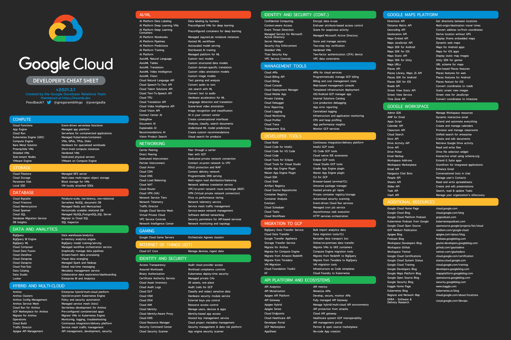

# The Google Cloud Developer's Cheat Sheet
Every product, feature and service in the Google Cloud family described in <=4 words (with liberal use of hyphens and slashes :smirk:) by the Google Developer Relations Team

Check out the *NEW* [interactive version of the cheat sheet](https://goo.gle/GCdevelopercheatsheet) 

Here are the downloadable versions as well: 

White background:
[High-resolution PNG](Poster-hires.png)
|
[Medium-res PNG](Poster-medres.png)
|
[Low-res PNG](Poster-lowres.png)\
Dark background:
[High-resolution PNG](DarkPoster-hires.png)
|
[Medium-res PNG](DarkPoster-medres.png)
|
[Low-res PNG](DarkPoster-lowres.png)
Desktop Wallpapers: [16:9 (iMac, etc.)](Wallpaper-16-9.png) | [16:10 (Macbook Pro)](Wallpaper-16-10.png) | [4:3 (Older computers)](Wallpaper-4-3.png) | [3:2 (Pixelbook)](Wallpaper-3-2.png)\

Text descriptions with links are below

Suggestions for better descriptions? Missing products? Pull requests are welcome on README.md (this file).

Feedback? [@pvergadia](https://twitter.com/pvergadia) or [@GoogleCloudTech](https://twitter.com/GoogleCloudTech). 

**Note:** This list only includes products that are publicly available. There are several products in pre-release/private-alpha that will not be included until they go public preview, beta or GA.

Fun flashback - [here's the list of products in 2014](https://web.archive.org/web/20140702161745/https://cloud.google.com/products/)

Many of these products have a [free tier](https://cloud.google.com/free/). There is also a [free trial](https://console.cloud.google.com/freetrial) that will enable you try almost everything.

Many of these products have a [visual Google Cloud Sketchnote](https://goo.gle/gcpsketchnote) to provide you a one pager visual overview of what each of these products are and how you can use them.

----------------------------
# All Products
:link:-Product page
:page_facing_up:-Documentation

### Compute

* **Cloud Functions**: Event-driven serverless functions [:link:](https://cloud.google.com/functions/) [:page_facing_up:](https://cloud.google.com/functions/docs/)
* **App Engine**: Managed app platform [:link:](https://cloud.google.com/appengine/) 
[:page_facing_up:](https://cloud.google.com/appengine/docs/)
* **Cloud Run**: Serverless for containerized applications [:link:](https://cloud.google.com/run/) [:page_facing_up:](https://cloud.google.com/run/docs/)
* **Google Kubernetes Engine (GKE)**: Managed Kubernetes/containers [:link:](https://cloud.google.com/kubernetes-engine/) [:page_facing_up:](https://cloud.google.com/kubernetes-engine/docs/)
* **Compute Engine**: VMs, GPUs, TPUs, Disks [:link:](https://cloud.google.com/compute/) [:page_facing_up:](https://cloud.google.com/compute/docs/)
* **Bare Metal Solution**: Hardware for specialized workloads [:link:](https://cloud.google.com/bare-metal) 
* **Preemptible VMs**: Short-lived compute instances [:link:](https://cloud.google.com/preemptible-vms) [:page_facing_up:](https://cloud.google.com/compute/docs/instances/preemptible)
* **Shielded VMs**: Hardened VMs [:link:](https://cloud.google.com/shielded-vm/) [:page_facing_up:](https://cloud.google.com/security/shielded-cloud/shielded-vm/)
* **Sole-tenant Nodes**: Dedicated physical servers [:link:](https://cloud.google.com/sole-tenant-nodes) [:page_facing_up:](https://cloud.google.com/compute/docs/nodes)
* **VMware Engine**: VMware as a service [:link:](https://cloud.google.com/vmware-engine) [:page_facing_up:](https://cloud.google.com/vmware-engine/docs)

### Storage
  
* **Cloud Filestore**: Managed NFS server [:link:](https://cloud.google.com/filestore/) [:page_facing_up:](https://cloud.google.com/filestore/docs/)
* **Cloud Storage**: Multi-class multi-region object storage[:link:](https://cloud.google.com/storage/) [:page_facing_up:](https://cloud.google.com/storage/docs/)
* **Persistent Disk**: Block storage for VMs [:link:](https://cloud.google.com/persistent-disk/) [:page_facing_up:](https://cloud.google.com/compute/docs/disks/)
* **Local SSD**: VM locally attached SSDs [:link:](https://cloud.google.com/local-ssd) [:page_facing_up:](https://cloud.google.com/compute/docs/disks/local-ssd)
  
### Database 
  
* **Cloud Bigtable**: Petabyte-scale, low-latency, non-relational [:link:](https://cloud.google.com/bigtable/) [:page_facing_up:](https://cloud.google.com/bigtable/docs/)
* **Cloud Firestore**: Serverless NoSQL document database [:link:](https://cloud.google.com/firestore/) [:page_facing_up:](https://cloud.google.com/firestore/docs/)
* **Cloud Memorystore**: Managed Redis and Memcached [:link:](https://cloud.google.com/memorystore/) [:page_facing_up:](https://cloud.google.com/memorystore/docs/)
* **Cloud Spanner**: Horizontally scalable relational database [:link:](https://cloud.google.com/spanner/) [:page_facing_up:](https://cloud.google.com/spanner/docs/)
* **Cloud SQL**: Managed MySQL, PostgreSQL, SQL Server [:link:](https://cloud.google.com/sql/) [:page_facing_up:](https://cloud.google.com/sql/docs/)
* **Database Migration Service**: Migrate to Cloud SQL [:link:](https://cloud.google.com/database-migration) [:page_facing_up:](https://cloud.google.com/database-migration/docs)
* **Cloud SQL Insights**: SQL Inspector [:link:](https://cloud.google.com/sql/docs/postgres/insights-overview) [:page_facing_up:](https://cloud.google.com/sql/docs/postgres/using-insights)
  
### Data Analytics 
  
* **BigQuery**: Data warehouse and analytics [:link:](https://cloud.google.com/bigquery/) [:page_facing_up:](https://cloud.google.com/bigquery/docs/)
* **BigQuery BI Engine**: In-memory analytics engine [:page_facing_up:](https://cloud.google.com/bi-engine/docs/)
* **BigQuery ML**: BigQuery model training/serving [:page_facing_up:](https://cloud.google.com/bigquery-ml/docs/)
* **BigQuery GIS**: BigQuery geospatial functions/support [:page_facing_up:](https://cloud.google.com/bigquery/docs/gis)
* **BigQuery Data Transfer Service**: Automated data ingestion service [:page_facing_up:](https://cloud.google.com/bigquery-transfer/docs)
* **Connected Sheets**: Spreadsheet interface for (big)data [:page_facing_up:](https://cloud.google.com/bigquery/docs/connected-sheets)
* **Cloud Composer**: Managed workflow orchestration service [:link:](https://cloud.google.com/composer/) [:page_facing_up:](https://cloud.google.com/composer/docs/)
* **Cloud Data Fusion**: Graphically manage data pipelines [:link:](https://cloud.google.com/data-fusion/) [:page_facing_up:](https://cloud.google.com/data-fusion/docs/)
* **Dataflow**: Stream/batch data processing [:link:](https://cloud.google.com/dataflow/) [:page_facing_up:](https://cloud.google.com/dataflow/docs/)
* **Dataprep by Trifacta**: Visual data wrangling [:link:](https://cloud.google.com/dataprep/) [:page_facing_up:](https://cloud.google.com/dataprep/docs/)
* **Dataproc**: Managed Spark and Hadoop [:link:](https://cloud.google.com/dataproc/) [:page_facing_up:](https://cloud.google.com/dataproc/docs/)
* **Datastream**: Change data capture/replication service [:link:](https://cloud.google.com/datastream) [:page_facing_up:](https://cloud.google.com/datastream/docs)
* **Pub/Sub**: Global real-time messaging [:link:](https://cloud.google.com/pubsub/) [:page_facing_up:](https://cloud.google.com/pubsub/docs/)
* **Data Catalog**: Metadata management service  [:link:](https://cloud.google.com/data-catalog/) [:page_facing_up:](https://cloud.google.com/data-catalog/docs/)
* **Google Data Studio**: Collaborative data exploration/dashboarding [:link:](https://datastudio.google.com/overview) [:page_facing_up:](https://datastudio.google.com/overviewdocs/)
* **Looker**: Enterprise BI and analytics [:link:](https://cloud.google.com/looker)
* **Public Datasets**: Hosted data in BigQuery[:page_facing_up:](https://cloud.google.com/public-datasets)

### Hybrid and multi-cloud
* **Anthos**: Enterprise hybrid/multi-cloud platform [:link:](https://cloud.google.com/anthos/) [:page_facing_up:](https://cloud.google.com/anthos/docs/)
* **Anthos clusters**: Hybrid/on-premises GKE [:link:](https://cloud.google.com/anthos/gke) [:page_facing_up:](https://cloud.google.com/anthos/gke/docs/on-prem/)
* **Anthos Config Management**:Policy and security automation [:link:](https://cloud.google.com/anthos/config-management) [:page_facing_up:](https://cloud.google.com/anthos-config-management/docs)
* **Anthos Service Mesh**: Managed service mesh (Istio) [:link:](https://cloud.google.com/anthos/service-mesh) [:page_facing_up:](https://cloud.google.com/service-mesh/docs)
* **Cloud Run for Anthos**: Serverless development for Anthos [:link:](https://cloud.google.com/anthos/run) [:page_facing_up:](https://cloud.google.com/run/docs/quickstarts/prebuilt-deploy-gke)
* **Google Cloud Marketplace for Anthos**: Pre-configured containerized apps [:link:](https://cloud.google.com/kubernetes-applications) [:page_facing_up:](https://cloud.google.com/marketplace/docs/kubernetes-apps)
* **Migrate for Anthos and GKE**: Migrate VMs to GKE [:link:](https://cloud.google.com/migrate/anthos/) [:page_facing_up:](https://cloud.google.com/migrate/anthos/docs/getting-started)
* **Google Cloud's operations suite**: Monitoring, logging, troubleshooting [:link:](https://cloud.google.com/products/operations) [:page_facing_up:](https://cloud.google.com/stackdriver/docs)
* **Traffic Director**: Service mesh traffic management [:link:](https://cloud.google.com/traffic-director/) [:page_facing_up:](https://cloud.google.com/traffic-director/docs/)
* **Apigee API Management**: API management, development, security [:link:](https://cloud.google.com/apigee)

### AI and ML

* **Vertex AI**: Managed platform for ML [:link:](https://cloud.google.com/ai-platform/) 
* **AutoML**: Custom low-code models [:page_facing_up:](https://cloud.google.com/vertex-ai/docs/training/training)
* **Vertex AI Data Labeling**: Data labeling by humans [:page_facing_up:](https://cloud.google.com/data-labeling/docs/)
* **Deep Learning VM Images**: Preconfigured VMs for deep learning [:link:](https://cloud.google.com/deep-learning-vm/) [:page_facing_up:](https://cloud.google.com/deep-learning-vm/docs/)
* **Vertex AI Workbench**:Jupyter-based environment for Data Science  [:link:](https://cloud.google.com/vertex-ai-workbench)  [:page_facing_up:](https://cloud.google.com/vertex-ai/docs/workbench)
* **Deep Learning Containers**: Preconfigured containers for deep learning [:link:](https://cloud.google.com/ai-platform/deep-learning-containers/) [:page_facing_up:](https://cloud.google.com/ai-platform/deep-learning-containers/docs/)
* **Vertex AI Matching Engine**: Vector similarity searches [:link:](https://cloud.google.com/vertex-ai/docs/matching-engine)[:page_facing_up:](https://cloud.google.com/vertex-ai/docs/matching-engine)
* **Vertex AI Pipelines**: Hosted ML workflows[:link:](https://cloud.google.com/ai-platform/pipelines/)
* **Vertex AI Predictions**: Autoscaled model serving [:page_facing_up:](https://cloud.google.com/ai-platform/prediction/docs/overview)
* **Vertex AI Training**: Distributed AI training [:page_facing_up:](https://cloud.google.com/ai-platform/training/docs/overview)
* **Vertex AI Edge Manager**: Deploy monitor edge inferences [:page_facing_up:](https://https://cloud.google.com/vertex-ai/docs/)
* **Vertex Explainable AI**: Understand ML model predictions [:link:](https://cloud.google.com/vertex-ai/docs/explainable-ai/overview) [:page_facing_up:](https://cloud.google.com/vertex-ai/docs/explainable-ai)
* **Vertex AI Feature Store**: Managed ML feature repository [:link:](https://cloud.google.com/vertex-ai/docs/featurestore) [:page_facing_up:](https://cloud.google.com/vertex-ai/docs/featurestore/overview)
* **Vertex ML Metadata**: Artifact, lineage, and execution tracking [:link:](https://cloud.google.com/vertex-ai/docs/ml-metadata) [:page_facing_up:](https://cloud.google.com/vertex-ai/docs/ml-metadata/introduction)
* **Vertex AI Model Monitoring**: Monitor models for skew/drift [:link:](https://cloud.google.com/vertex-ai/docs/model-monitoring) [:page_facing_up:](https://cloud.google.com/vertex-ai/docs/model-monitoring/overview)
* **Vertex AI Tensorboard**: Managed TensorBoard for ML-experiment Visualization [:link:](https://cloud.google.com/vertex-ai/docs/experiments) [:page_facing_up:](https://cloud.google.com/vertex-ai/docs/experiments/tensorboard-overview)
* **Vertex AI Vizier**: black-box hyperparameter tuning [:link:](https://cloud.google.com/vertex-ai/docs/vizier/overview) [:page_facing_up:](https://cloud.google.com/vertex-ai/docs/vizier)
* **Speech-To-Text**: Convert audio to text [:link:](https://cloud.google.com/speech/) [:page_facing_up:](https://cloud.google.com/speech/docs/)
* **Talent Solutions**: Job search with ML [:link:](https://cloud.google.com/job-discovery/) [:page_facing_up:](https://cloud.google.com/job-discovery/docs/)
* **Text-To-Speech**: Convert text to audio [:link:](https://cloud.google.com/text-to-speech/) [:page_facing_up:](https://cloud.google.com/text-to-speech/docs/)
* **Cloud TPU**: Hardware acceleration for ML [:link:](https://cloud.google.com/tpu/) [:page_facing_up:](https://cloud.google.com/tpu/docs/)
* **Cloud Translation**: Language detection and translation [:link:](https://cloud.google.com/translate/) [:page_facing_up:](https://cloud.google.com/translate/docs/)
* **Cloud Video Intelligence API**: Scene-level video annotation [:link:](https://cloud.google.com/video-intelligence/) [:page_facing_up:](https://cloud.google.com/video-intelligence/docs/)
* **Cloud Vision**: Image recognition and classification [:link:](https://cloud.google.com/vision/) [:page_facing_up:](https://cloud.google.com/vision/docs/)
* **Contact Center AI**: AI in your contact center[:link:](https://cloud.google.com/solutions/contact-center/) [:page_facing_up:](https://cloud.google.com/solutions/contact-center/)
* **Dialogflow**: Create conversational interfaces [:link:](https://cloud.google.com/dialogflow-enterprise/) [:page_facing_up:](https://cloud.google.com/dialogflow-enterprise/docs/)
* **Document AI**: Analyze, classify, search documents [:link:](https://cloud.google.com/solutions/document-understanding/) [:page_facing_up:](https://cloud.google.com/document-understanding/docs/)
* **Recommendations AI**: Create custom recommendations [:link:](https://cloud.google.com/recommendations/) [:page_facing_up:](https://cloud.google.com/recommendations-ai/docs/)
* **Vision Product Search**: Visual search for products [:page_facing_up:](https://cloud.google.com/vision/product-search/docs/)

### Networking 
  
* **Carrier Peering**: Peer through a carrier [:page_facing_up:](https://cloud.google.com/interconnect/docs/how-to/carrier-peering)
* **Direct Peering**: Peer with Google Cloud [:page_facing_up:](https://cloud.google.com/interconnect/docs/how-to/direct-peering)
* **Dedicated Interconnect**: Dedicated private network connection [:page_facing_up:](https://cloud.google.com/interconnect/docs/details/dedicated)
* **Partner Interconnect**: Connect on-prem network to VPC [:page_facing_up:](https://cloud.google.com/interconnect/docs/concepts/partner-overview)
* **Google Cloud Armor**: DDoS protection and WAF [:link:](https://cloud.google.com/armor/) [:page_facing_up:](https://cloud.google.com/armor/docs/)
* **Cloud CDN**: Content delivery network [:link:](https://cloud.google.com/cdn/) [:page_facing_up:](https://cloud.google.com/cdn/docs/)
* **Cloud DNS**: Programmable DNS serving [:link:](https://cloud.google.com/dns/) [:page_facing_up:](https://cloud.google.com/dns/docs/)
* **Cloud Load Balancing**: Multi-region load distribution/balancing [:link:](https://cloud.google.com/load-balancing/) [:page_facing_up:](https://cloud.google.com/load-balancing/)
* **Cloud NAT**: Network address translation service [:page_facing_up:](https://cloud.google.com/nat/docs/overview/)
* **Cloud Router**: VPC/on-prem network route exchange (BGP) [:page_facing_up:](https://cloud.google.com/router/docs/)
* **Cloud VPN**: Virtual private network connection[:page_facing_up:](https://cloud.google.com/compute/docs/vpn/overview)
* **Network Service Tiers**: Price versus performance tiering [:link:](https://cloud.google.com/network-tiers/) [:page_facing_up:](https://cloud.google.com/network-tiers/docs/)
* **Network Telemetry**: Network telemetry service [:link:](https://cloud.google.com/network-telemetry/) [:page_facing_up:](https://cloud.google.com/vpc/docs/using-flow-logs/)
* **Traffic Director**: Service mesh traffic management [:link:](https://cloud.google.com/traffic-director/) [:page_facing_up:](https://cloud.google.com/traffic-director/docs/)
* **Anthos Service Mesh**: Service-aware network management [:link:](https://cloud.google.com/service-mesh/) [:page_facing_up:](https://cloud.google.com/trace/docs/)
* **Virtual Private Cloud**: Software defined networking [:link:](https://cloud.google.com/vpc/) [:page_facing_up:](https://cloud.google.com/vpc/docs/)
* **Cloud Domains**: Register, transfer, manager domains [:link:](https://cloud.google.com/domains) [:page_facing_up:](https://cloud.google.com/domains/docs/)
* **VPC Service Controls**: Security perimeters for API-based services [:link:](https://cloud.google.com/vpc-service-controls/) [:page_facing_up:](https://cloud.google.com/vpc-service-controls/)
* **Network Intelligence Center**: Network monitoring and topology [:link:](https://cloud.google.com/network-intelligence-center/)
[:page_facing_up:](https://cloud.google.com/network-intelligence-center/docs/)
* **Service Directory**: Centrally publish/discover/connect services [:link:](https://cloud.google.com/service-directory)
[:page_facing_up:](https://cloud.google.com/service-directory/docs)
* **Private Service Connect**: Privately connect services across VPCs [:link:](https://cloud.google.com/service-directory)
[:page_facing_up:](https://cloud.google.com/vpc/docs/private-service-connect)
* **Network Connectivity Center**: Connect VPC & On-prem [:link:](https://cloud.google.com/network-connectivity-center)
[:page_facing_up:](https://cloud.google.com/network-connectivity/docs/network-connectivity-center)
* **Packet Mirroring**: Monitor/analyze instance traffic [:page_facing_up:](https://cloud.google.com/vpc/docs/packet-mirroring)
* **Cloud IDS**: Detects network based threats [:link:](https://cloud.google.com/intrusion-detection-system)
[:page_facing_up:](https://cloud.google.com/intrusion-detection-system/docs)
 

### Identity and Security
  
* **Access Transparency**: Audit cloud provider access [:link:](https://cloud.google.com/access-transparency/) [:page_facing_up:](https://cloud.google.com/logging/docs/audit/access-transparency-overview/)
* **Assured Workloads**: Workload compliance controls [:link:](https://cloud.google.com/assured-workloads) [:page_facing_up:](https://cloud.google.com/assured-workloads/docs)
* **Binary Authorization**: Kubernetes deploy-time security [:link:](https://cloud.google.com/binary-authorization/) [:page_facing_up:](https://cloud.google.com/binary-authorization/docs/)
* **Certificate Authority Service**: Managed private CAs [:link:](https://cloud.google.com/certificate-authority-service) [:page_facing_up:](https://cloud.google.com/certificate-authority-service/docs)
* **Cloud Asset Inventory**: All assets, one place [:link:](https://cloud.google.com/asset-inventory) [:page_facing_up:](https://cloud.google.com/asset-inventory/docs/overview)
* **Cloud Audit Logs**: Audit trails for Google Cloud [:link:](https://cloud.google.com/audit-logs/) [:page_facing_up:](https://cloud.google.com/logging/docs/audit/)
* **Cloud Data Loss Prevention (DLP)**: Classify and redact sensitive data [:link:](https://cloud.google.com/dlp/) [:page_facing_up:](https://cloud.google.com/dlp/docs/)
* **Cloud HSM**: Hardware security module service [:link:](https://cloud.google.com/hsm/) [:page_facing_up:](https://cloud.google.com/kms/docs/hsm/)
* **Cloud External Key Manager (EKM)**: External keys you control [:link:](https://cloud.google.com/ekm/) [:page_facing_up:](https://cloud.google.com/kms/docs/ekm/)
* **Cloud IAM**: Resource access control [:link:](https://cloud.google.com/iam/) [:page_facing_up:](https://cloud.google.com/iam/docs/)
* **Cloud Identity**: Manage users, devices & apps [:link:](https://cloud.google.com/identity/) [:page_facing_up:](https://cloud.google.com/identity/solutions/overview/)
* **Cloud Identity-Aware Proxy**: Identity-based app access [:link:](https://cloud.google.com/iap/) [:page_facing_up:](https://cloud.google.com/iap/docs/)
* **Cloud Key Management Service**: Hosted key management service [:link:](https://cloud.google.com/kms/) [:page_facing_up:](https://cloud.google.com/kms/docs/)
* **Resource Manager**: Cloud project metadata management [:link:](https://cloud.google.com/resource-manager/) [:page_facing_up:](https://cloud.google.com/resource-manager/docs/)
* **Security Command Center**: Security management and data risk platform [:link:](https://cloud.google.com/security-command-center/) [:page_facing_up:](https://cloud.google.com/security-command-center/docs/)
* **Web Security Scanner**: App engine security scanner [:link:](https://cloud.google.com/security-scanner/) [:page_facing_up:](https://cloud.google.com/security-scanner/docs/)
* **Confidential Computing**: Encrypt data in-use [:link:](https://cloud.google.com/confidential-computing) [:page_facing_up:](https://cloud.google.com/confidential-computing/docs)
* **Access Context Manager**: End-user attribute-based access control [:link:](https://cloud.google.com/context-aware-access/) [:page_facing_up:](https://cloud.google.com/iap/docs/cloud-iap-context-aware-access-howto/)
* **Event Threat Detection**: Scans for suspicious activity [:link:](https://cloud.google.com/event-threat-detection/) 
* **Managed Service for Microsoft Active Directory**: Managed Microsoft Active Directory  [:link:](https://cloud.google.com/managed-microsoft-ad/) [:page_facing_up:](https://cloud.google.com/managed-microsoft-ad/docs/)
* **Secret Manager**: Store and manage secrets [:link:](https://cloud.google.com/secret-manager/) [:page_facing_up:](https://cloud.google.com/secret-manager/docs/)
* **Security Key Enforcement**: Two-step key verification [:link:](https://cloud.google.com/security-key/)
* **Shielded VMs**: Hardened VMs [:link:](https://cloud.google.com/shielded-vm/) [:page_facing_up:](https://cloud.google.com/security/shielded-cloud/shielded-vm/)
* **Titan Security Key**: Two-factor authentication (2FA) device [:link:](https://cloud.google.com/titan-security-key/)
* **VPC Service Controls**: VPC data constraints [:link:](https://cloud.google.com/vpc-service-controls/) [:page_facing_up:](https://cloud.google.com/vpc-service-controls/docs/)
* **Chronicle**: Find threats from security telemetry  [:link:](https://chronicle.security/products/platform/) 
* **VirusTotal**: Research/hunt for malware  [:link:](https://chronicle.security/products/virustotal/) 
* **Risk Manager**: Evaluate organization’s security posture  [:link:](https://cloud.google.com/risk-manager/docs) 
* **reCAPTCHA Enterprise**: Protection against bot/spam/abuse [:link:](https://cloud.google.com/recaptcha-enterprise) [:page_facing_up:](https://cloud.google.com/recaptcha-enterprise/docs/)
* **BeyondCorp Enterprise**: Zero trust secure access [:link:](https://cloud.google.com/beyondcorp-enterprise) [:page_facing_up:](https://cloud.google.com/beyondcorp-enterprise/docs)
* **Access Context Manager**: Fine-grained, attribute based access-control [:page_facing_up:](https://cloud.google.com/access-context-manager/docs)
* **Web Security Scanner**: Identifies  web-app security vulnerabilities [:page_facing_up:](https://cloud.google.com/security-command-center/docs/concepts-web-security-scanner-overview)

### Operations & Monitoring
* **Cloud Debugger**: Live production debugging [:link:](https://cloud.google.com/debugger/) [:page_facing_up:](https://cloud.google.com/debugger/docs/)
* **Error Reporting**: App error reporting [:link:](https://cloud.google.com/error-reporting/) [:page_facing_up:](https://cloud.google.com/error-reporting/docs/)
* **Cloud Logging**: Centralized logging [:link:](https://cloud.google.com/logging/) [:page_facing_up:](https://cloud.google.com/logging/docs/)
* **Cloud Monitoring**: Infrastructure and application monitoring [:link:](https://cloud.google.com/monitoring/) [:page_facing_up:](https://cloud.google.com/monitoring/docs/)
* **Cloud Profiler**: CPU and heap profiling [:link:](https://cloud.google.com/profiler/) [:page_facing_up:](https://cloud.google.com/profiler/docs/)
* **Cloud Trace**: App latency insights [:link:](https://cloud.google.com/trace/) [:page_facing_up:](https://cloud.google.com/trace/docs/)  
 
 
### DevOps CI/CD

* **Cloud Build**: Continuous integration/delivery platform [:link:](https://cloud.google.com/cloud-build/) [:page_facing_up:](https://cloud.google.com/cloud-build/docs/)
* **Cloud Deploy**: Deployment pipeline for GKE [:link:](https://cloud.google.com/deploy) [:page_facing_up:](https://cloud.google.com/deploy/docs/)
* **Artifact Registry**: Universal package manager [:link:](https://cloud.google.com/artifacts/) [:page_facing_up:](https://cloud.google.com/artifacts/)
* **Cloud Source Repositories**: Hosted private git repos [:link:](https://cloud.google.com/source-repositories/) [:page_facing_up:](https://cloud.google.com/source-repositories/docs/)
* **Container Registry**: Private container registry/storage [:link:](https://cloud.google.com/container-registry/) [:page_facing_up:](https://cloud.google.com/container-registry/docs/)

### Application Integration
* **Eventarc**: Event-driven Cloud Run services [:link:](https://cloud.google.com/eventarc/) [:page_facing_up:](https://cloud.google.com/eventarc/docs/)
* **Cloud Scheduler**: Managed cron job service [:link:](https://cloud.google.com/scheduler/) [:page_facing_up:](https://cloud.google.com/scheduler/docs/)
* **Cloud Tasks**: Asynchronous task execution [:link:](https://cloud.google.com/tasks/) [:page_facing_up:](https://cloud.google.com/tasks/docs/)
* **Workflows**: HTTP services orchestration [:link:](https://cloud.google.com/workflows/) [:page_facing_up:](https://cloud.google.com/workflows/docs/)
* **Pub/Sub**: Global real-time messaging [:link:](https://cloud.google.com/pubsub/) [:page_facing_up:](https://cloud.google.com/pubsub/docs/)

### API Platform and Ecosystems   
* **API Analytics**: API metrics [:link:](https://cloud.google.com/api-analytics/)
* **API Monetization**: Monetize APIs [:link:](https://cloud.google.com/api-monetization/)
* **Apigee API Platform**: Develop, secure, monitor APIs [:link:](https://cloud.google.com/apigee-api-management/)
* **API Gateway**: Fully managed API Gateway [:link:](https://cloud.google.com/api-gateway)
* **Apigee Hybrid**: Manage hybrid/multi-cloud API environments [:link:](https://cloud.google.com/apigee/api-management/hybrid/)[:page_facing_up:](https://docs.apigee.com/hybrid/beta2)
* **Apigee Sense**: API protection from attacks [:link:](https://cloud.google.com/apigee-sense/)
* **Cloud Endpoints**: Cloud API gateway [:link:](https://cloud.google.com/endpoints/)
* **Developer Portal**: API management portal [:link:](https://cloud.google.com/developer-portal/)
* **Marketplace**: Partner & open source marketplace [:link:](https://cloud.google.com/marketplace/)
* **AppSheet**: No-code App creation [:link:](https://www.appsheet.com/)

### Internet of Things (IoT) 
  
* **Cloud IoT Core**: Manage devices, ingest data [:link:](https://cloud.google.com/iot-core/) [:page_facing_up:](https://cloud.google.com/iot-core/docs/)
  
### Gaming
* **Google Cloud Game Servers**: Orchestrate Agones clusters [:link:](https://cloud.google.com/game-servers)

### Healthcare
* **Cloud Healthcare API**: Healthcare system Google Cloud interoperability [:link:](https://cloud.google.com/healthcare-api/)
* **Apigee Healthcare APIx**: Healthcare system Google Cloud interoperability [:link:](https://cloud.google.com/solutions/apigee-health-apix)
* **Healthcare Natural Language AI**: Real-time insights from media-text [:link:](https://cloud.google.com/healthcare-api/docs/how-tos/nlp)
* *Cloud Life Sciences**: Manage, process, transform biomedical-data [:link:](https://cloud.google.com/life-sciences)[:page_facing_up:](https://cloud.google.com/life-sciences/docs)

### Retail
* **Vision Product Search**: Visual search for products [:page_facing_up:](https://cloud.google.com/vision/product-search/docs/)
* **Recommendations AI**: Create custom recommendations [:link:](https://cloud.google.com/recommendations/) [:page_facing_up:](https://cloud.google.com/recommendations-ai/docs/)
* **Visual Inspection AI**: Train/deploy models to detect defects [:link:](https://cloud.google.com/solutions/visual-inspection-ai) 

 ### Management Tools
* **VM Manager**: Manage OS VM Fleets [:page_facing_up:](https://cloud.google.com/compute/docs/vm-manager)
* **Cloud APIs**: APIs for cloud services [:link:](https://cloud.google.com/apis/) [:page_facing_up:](https://cloud.google.com/apis/docs/)
* **Cloud Billing API**: Programmatically manage Google Cloud billing [:page_facing_up:](https://cloud.google.com/billing/docs/)
* **Cloud Billing**: Billing and cost management tools [:link:](https://cloud.google.com/billing/docs/) [:page_facing_up:](https://cloud.google.com/billing/docs/docs/)
* **Cloud Console**: Web-based management console [:link:](https://cloud.google.com/cloud-console/)
* **Cloud Deployment Manager**: Templated infrastructure deployment [:link:](https://cloud.google.com/deployment-manager/) [:page_facing_up:](https://cloud.google.com/deployment-manager/docs/)
* **Cloud Mobile App**: iOS/Android Google Cloud manager app [:link:](https://cloud.google.com/console-app/)
* **Private Catalog**: Internal Solutions Catalog [:link:](https://cloud.google.com/private-catalog/) [:page_facing_up:](https://cloud.google.com/private-catalog/docs/)
* **Carbon Footprint**: Report and reduce carbon emissions [:link:](https://cloud.google.com/carbon-footprint) [:page_facing_up:](https://cloud.google.com/carbon-footprint/docs)

### Developer Tools  
  
* **Cloud Code for IntelliJ**: IntelliJ Google Cloud tools [:link:](https://cloud.google.com/intellij/)
* **Cloud Code for VS Code**: VS Code Google Cloud tools [:link:](https://cloud.google.com/code/docs/vscode/)
* **Cloud Code**: Cloud native IDE extensions [:link:](https://cloud.google.com/code/) [:page_facing_up:](https://cloud.google.com/code/docs/)
* **Cloud Tools for Eclipse**: Eclipse Google Cloud tools [:link:](https://cloud.google.com/eclipse/docs/)
* **Cloud Tools for Visual Studio**: Visual Studio Google Cloud tools [:link:](https://cloud.google.com/visual-studio/)
* **App Engine Plugins**: Gradle/Maven App Engine plugin [:link:](https://github.com/GoogleCloudPlatform/app-gradle-plugin)
* **Cloud SDK**: CLI for Google Cloud [:link:](https://cloud.google.com/sdk/) [:page_facing_up:](https://cloud.google.com/sdk/docs/)
* **Cloud Shell**: Browser-based terminal/CLI [:link:](https://cloud.google.com/shell/) [:page_facing_up:](https://cloud.google.com/shell/docs/)

### Migration to Google Cloud  
  
* **BigQuery Data Transfer Service**: Bulk import analytics data [:link:](https://cloud.google.com/bigquery/transfer/) [:page_facing_up:](https://cloud.google.com/bigquery/transfer/docs/)
* **Cloud Data Transfer**: Data migration tools/CLI [:link:](https://cloud.google.com/products/data-transfer/)
* **Google Transfer Appliance**: Rentable data transport box [:link:](https://cloud.google.com/transfer-appliance/) [:page_facing_up:](https://cloud.google.com/transfer-appliance/docs/)
* **Storage Transfer Service**: Online/on-premises data transfer [:page_facing_up:](https://cloud.google.com/storage-transfer-service/)
* **Migrate for Anthos and GKE**: Migrate VMs to GKE [:link:](https://cloud.google.com/migrate/anthos/) [:page_facing_up:](https://cloud.google.com/migrate/anthos/docs/getting-started)
* **Migrate for Compute Engine**: Compute Engine migration tools [:link:](https://cloud.google.com/migrate/compute-engine/) [:page_facing_up:](https://cloud.google.com/velostrata/docs/)
* **Migrate from Amazon Redshift**: Migrate from Redshift to BigQuery [:link:](https://cloud.google.com/bigquery/docs/redshift-migration) 
* **Migrate from Teradata**: Migrate from Teradata to BigQuery [:link:](https://cloud.google.com/solutions/migration/td2bq/td-bq-migration-overview) 
* **Cloud Foundation Toolkit**: Infrastructure as Code templates [:link:](https://cloud.google.com/foundation-toolkit) 
* **KF**: Cloud Foundry to Kubernetes [:link:](https://cloud.google.com/migrate/kf/docs)

  
### Google Maps Platform  
  
* **Directions API**: Get directions between locations [:link:](https://developers.google.com/maps/documentation/directions/)
* **Distance Matrix API**: Multi-origin/destination travel times [:link:](https://developers.google.com/maps/documentation/distance-matrix/intro)
* **Geocoding API**: Convert address to/from coordinates [:link:](https://developers.google.com/maps/documentation/geocoding/)
* **Geolocation API**: Derive location without GPS [:link:](https://developers.google.com/maps/documentation/geolocation/)
* **Maps Embed API**: Display iframe embedded maps [:link:](https://developers.google.com/maps/documentation/embed/)
* **Maps JavaScript API**: Dynamic web maps [:link:](https://developers.google.com/maps/documentation/javascript/)
* **Maps SDK for Android**: Maps for Android apps [:link:](https://developers.google.com/maps/documentation/android-sdk/)
* **Maps SDK for iOS**: Maps for iOS apps [:link:](https://developers.google.com/maps/documentation/ios-sdk/)
* **Maps Static API**: Display static map images [:link:](https://developers.google.com/maps/documentation/maps-static/)
* **Maps SDK for Unity**: Unity SDK for games [:link:](https://cloud.google.com/maps-platform/gaming/)
* **Maps URLs**: URL scheme for maps [:link:](https://developers.google.com/maps/documentation/urls/)
* **Places API**: Rest-based Places features [:link:](https://developers.google.com/places/web-service/)
* **Places Library, Maps JS API**: Places features for web [:link:](https://developers.google.com/maps/documentation/javascript/places)
* **Places SDK for Android**: Places features for Android [:link:](https://developers.google.com/places/android-sdk/)
* **Places SDK for iOS**: Places feature for iOS [:link:](https://developers.google.com/places/ios-sdk/)
* **Roads API**: Convert coordinates to roads [:link:](https://developers.google.com/maps/documentation/roads/)
* **Street View Static API**: Static street view images [:link:](https://developers.google.com/maps/documentation/streetview/)
* **Street View Service**: Street view for JavaScript [:link:](https://developers.google.com/maps/documentation/javascript/streetview/)
* **Time Zone API**: Convert coordinates to timezone [:link:](https://developers.google.com/maps/documentation/timezone/)
  
### Workspace Platform  
  
* **Admin SDK**: Manage Google Workspace resources [:link:](https://developers.google.com/admin-sdk)
* **AMP for Email**: Dynamic interactive email [:link:](https://developers.google.com/gmail)
* **Apps Script**: Extend and automate everything [:link:](https://developers.google.com/apps-script/)
* **Calendar API**: Create and manage calendars [:link:](https://developers.google.com/calendar/)
* **Classroom API**: Provision and manage classrooms [:link:](https://developers.google.com/classroom)
* **Cloud Search**: Unified search for enterprise [:link:](https://developers.google.com/cloud-search/docs/guides/)
* **Docs API**: Create and edit documents [:link:](https://developers.google.com/docs/api/)
* **Drive Activity API**: Retrieve Google Drive activity [:link:](https://developers.google.com/drive/activity/)
* **Drive API**: Read and write files [:link:](https://developers.google.com/drive/)
* **Drive Picker**: Drive file selection widget [:link:](https://developers.google.com/picker/)
* **Email Markup**: Interactive email using schema.org [:link:](https://developers.google.com/gmail/markup/)
* **Google Workspace Add-ons**:  Extend Google Workspace apps [:link:](https://developers.google.com/gsuite/add-ons)
* **Google Workspace Marketplace**: Storefront for integrated applications [:link:](https://developers.google.com/gsuite/marketplace/)
* **Gmail API**: Enhance Gmail [:link:](https://developers.google.com/gmail/)
* **Google Chats API**: Conversational bots in chat [:link:](https://developers.google.com/chat)
* **People API**: Manage user's Contacts [:link:](https://developers.google.com/people/)
* **Sheets API**: Read and write spreadsheets [:link:](https://developers.google.com/sheets/api/)
* **Slides API**: Create and edit presentations [:link:](https://developers.google.com/slides/)
* **Task API**: Search, read & update Tasks [:link:](https://developers.google.com/tasks/)
* **Vault API**: Manage your organization's eDiscovery [:link:](https://developers.google.com/vault/)
  
### Mobile (Firebase)  
  
* **Cloud Firestore**: Document store and sync [:link:](https://firebase.google.com/products/firestore/)
* **Cloud Functions for Firebase**: Event-driven serverless applications [:link:](https://firebase.google.com/products/functions/)
* **Cloud Storage for Firebase**: Object storage and serving [:link:](https://firebase.google.com/products/storage/)
* **Crashlytics**: Crash reporting and analytics [:link:](https://fabric.io/kits/android/crashlytics/summary)
* **Firebase A/B Testing**: Create A/B test experiments [:link:](https://firebase.google.com/products/ab-testing/)
* **Firebase App Distribution**: Trusted tester early access [:link:](https://firebase.google.com/products/app-distribution/)
* **Firebase Authentication**: Drop-in authentication [:link:](https://firebase.google.com/products/auth/)
* **Firebase Cloud Messaging**: Send device notifications [:link:](https://firebase.google.com/products/cloud-messaging/)
* **Firebase Dynamic Links**: Link to app content [:link:](https://firebase.google.com/products/dynamic-links/)
* **Firebase Extensions**: Pre-packaged development solutions [:link:](https://firebase.google.com/products/extensions)
* **Firebase Hosting**: Web hosting with CDN/SSL [:link:](https://firebase.google.com/products/hosting/)
* **Firebase In-App Messaging**: Send in-app contextual messages [:link:](https://firebase.google.com/products/in-app-messaging/)
* **Firebase Performance Monitoring**: App/web performance monitoring [:link:](https://firebase.google.com/products/performance/)
* **Firebase Predictions**: Predict user targeting [:link:](https://firebase.google.com/products/predictions/)
* **Firebase Realtime Database**: Real-time data synchronization [:link:](https://firebase.google.com/products/realtime-database/)
* **Firebase Remote Config**: Remotely configure installed apps [:link:](https://firebase.google.com/docs/remote-config/)
* **Firebase Test Lab**: Mobile testing device farm [:link:](https://firebase.google.com/docs/test-lab/)
* **Google Analytics for Firebase**: Mobile app analytics [:link:](https://firebase.google.com/products/analytics/)
* **ML Kit for Firebase**: ML APIs for mobile [:link:](https://firebase.google.com/products/ml-kit/)
  
### Additional Resources

* **Google Cloud Home Page**: [:link:](https://cloud.google.com)
* **Google Cloud Blog**: [:link:](https://cloud.google.com/blog)
* **Google Cloud Platform Podcast**: [:link:](https://Google Cloudpodcast.com/)
* **Kubernetes Podcast from Google**: [:link:](https://kubernetespodcast.com/)
* **Google Cloud Reader**: [:link:](https://podcasts.google.com/feed/aHR0cHM6Ly9mZWVkcy50cmFuc2lzdG9yLmZtL2dvb2dsZS1jbG91ZC1yZWFkZXI=)
* **Google Cloud Open Source**: [:link:](https://opensource.google/projects/list/cloud)
* **Google Cloud Medium Publication**: [:link:](https://medium.com/google-cloud)
* **Apigee Blog**: [:link:](https://apigee.com/about/blog)
* **Firebase Blog**: [:link:](https://firebase.googleblog.com)
* **Google Workspace Developers Blog**: [:link:](https://gsuite-developers.googleblog.com)
* **Google Workspace GitHub**: [:link:](https://github.com/gsuitedevs)
* **Google Workspace Twitter**: [:link:](https://twitter.com/gsuitedevs)
* **Google Cloud Certifications**: [:link:](https://cloud.google.com/certification)
* **Google Cloud System Status**: [:link:](https://status.cloud.google.com)
* **Google Cloud Training**: [:link:](https://cloud.google.com/training)
* **Google Developers Blog**: [:link:](https://developers.googleblog.com) 
* **Google Maps Platform Blog**: [:link:](https://mapsplatform.googleblog.com)
* **Google Open Source Blog**: [:link:](https://opensource.googleblog.com)
* **Google Security Blog**: [:link:](https://security.googleblog.com)
* **Kaggle Home Page**: [:link:](https://www.kaggle.com) 
* **Kubernetes Blog**: [:link:](https://kubernetes.io/blog)
* **Regions and Network Map**: [:link:](https://cloud.google.com/about/locations)
* **DORA - Software & Delivery Research**: [:link:](https://cloud.google.com/devops)
* **Cloud Security Podcast**: [:link:](https://cloud.withgoogle.com/cloudsecurity/podcast/)
* **Google Cloud Sketchnote**: [:link:](https://goo.gle/Google Cloudsketchnote)

----------------------------
### Everything below is not included in the PDFs/PNGs due to space limitations

----------------------------

### Additional Resources

* **Source for this document**: [:link:](https://4words.dev)
* **Google Cloud Solutions Library**: [:link:](https://cloud.google.com/solutions/)
* **Google Workspace Solutions Gallery**: [:link:](https://developers.google.com/gsuite/solutions)
* **Google Cloud Support Hub**: [:link:](https://cloud.google.com/support-hub/)
* **Google Cloud Pricing**: [:link:](https://cloud.google.com/pricing/)
* **Google Cloud Pricing Calculator**: [:link:](https://cloud.google.com/products/calculator/)
* **Qwiklabs Home Page**: [:link:](https://www.qwiklabs.com/)
* **Codelabs Home Page**: [:link:](https://codelabs.developers.google.com/)
* **YouTube Channels**:
  * **Google Cloud**: [:link:](https://www.youtube.com/channel/UCTMRxtyHoE3LPcrl-kT4AQQ)
  * **Google Cloud Technical**: [:link:](https://www.youtube.com/user/googlecloudplatform)
  * **Google Workspace**: [:link:](https://www.youtube.com/user/GoogleApps)
  * **Google Developer's**: [:link:](https://www.youtube.com/user/GoogleDevelopers)
  * **Firebase**: [:link:](https://www.youtube.com/user/Firebase)
* **Reddit**:
  * **/r/googlecloud**: [:link:](https://www.reddit.com/r/googlecloud/)
  * **/r/AppEngine**: [:link:](https://www.reddit.com/r/AppEngine/)
  * **/r/bigquery**: [:link:](https://www.reddit.com/r/bigquery/)
  * **/r/dataflow**: [:link:](https://www.reddit.com/r/dataflow/)
  * **/r/firebase**: [:link:](https://www.reddit.com/r/firebase/)
  * **/r/GoogleAppsScript**: [:link:](https://www.reddit.com/r/GoogleAppsScript/)
* **Big Data / Data Analytics Product Comparisons**: [:link:](https://cloud.google.com/products/big-data)
* **Compute Product Comparisons**: [:link:](https://cloud.google.com/products/databases)
* **Database Product Comparisons**: [:link:](https://cloud.google.com/products/compute)
* **Networking Product Comparisons**: [:link:](https://cloud.google.com/products/networking)
* **Storage Product Comparisons**: [:link:](https://cloud.google.com/products/storage)

### Google Cloud Foundational Open Source Projects
  
* **Apache Beam**: Batch/streaming data processing [:link:](https://beam.apache.org/)
* **Go**: High Concurrency Programming Language [:link:](https://golang.org/)
* **gRPC**: RPC framework [:link:](https://grpc.io/)
* **gVisor**: Secure container runtime [:link:](https://github.com/google/gvisor)
* **Istio**: Connect and secure services [:link:](https://istio.io/)
* **Knative**: Serverless framework for Kubernetes [:link:](https://github.com/knative)
* **Kubeflow**: ML toolkit for Kubernetes [:link:](https://www.kubeflow.org/)
* **Kubernetes**: Management of containerized applications [:link:](https://kubernetes.io/)
* **OpenCensus**: Cloud native observability framework [:link:](https://opencensus.io/)
* **TensorFlow**: ML framework [:link:](https://www.tensorflow.org/)

### Platform Comparisons

* **Google Cloud Platform for AWS Professionals**: [:page_facing_up:](https://cloud.google.com/docs/compare/aws/)
* **Google Cloud Platform for Azure Professionals**: [:page_facing_up:](https://cloud.google.com/docs/compare/azure/)
* **Google Cloud Platform for Data Center Professionals**: [:page_facing_up:](https://cloud.google.com/docs/compare/data-centers/)
* **Google Cloud Platform for OpenStack Users**: [:page_facing_up:](https://cloud.google.com/docs/compare/openstack/)

### Language Specific Documentation

* **Apps Script**: [:page_facing_up:](https://developers.google.com/apps-script)
* **Java**: [:page_facing_up:](https://cloud.google.com/java/docs/)
* **Node.js**: [:page_facing_up:](https://cloud.google.com/nodejs/docs/)
* **Python**: [:page_facing_up:](https://cloud.google.com/python/docs/)
* **Go**: [:page_facing_up:](https://cloud.google.com/go/docs/)
* **Ruby**: [:page_facing_up:](https://cloud.google.com/ruby/docs/)
* **PHP**: [:page_facing_up:](https://cloud.google.com/php/docs/)
* **.NET/C#**: [:page_facing_up:](https://cloud.google.com/dotnet/docs/)

